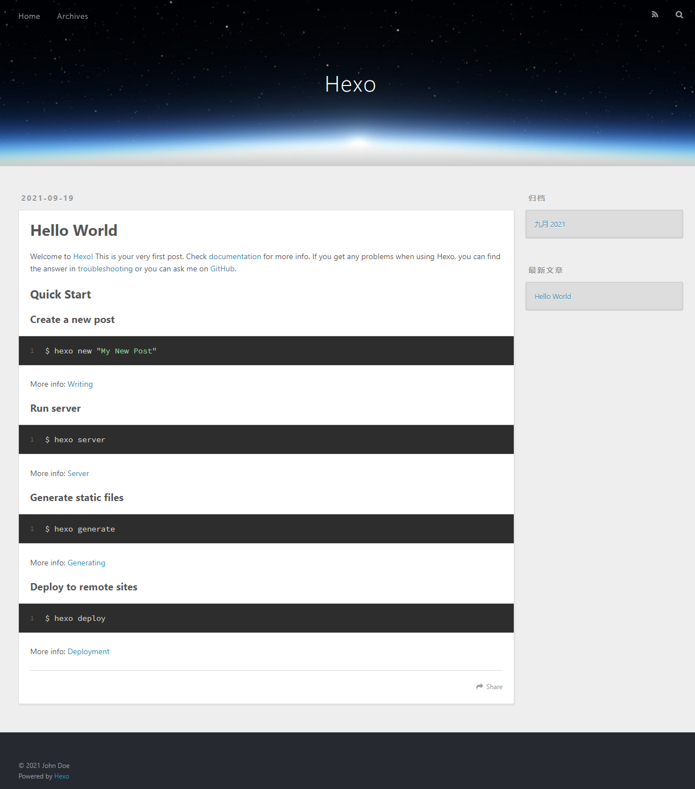
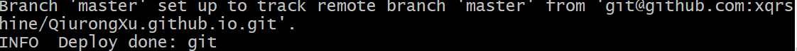
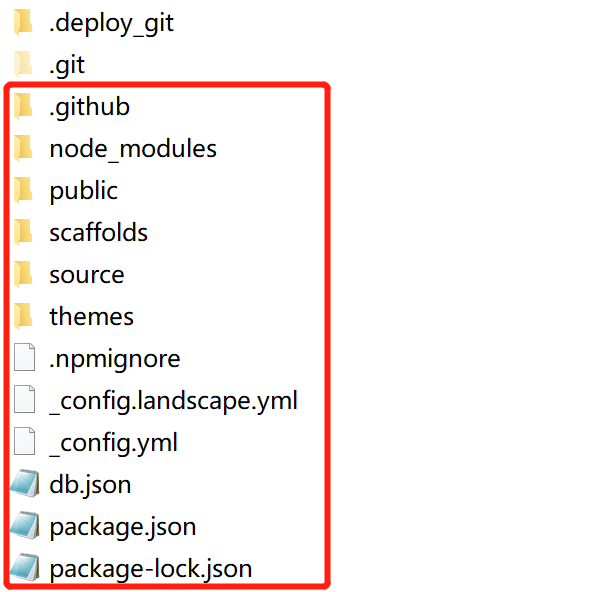
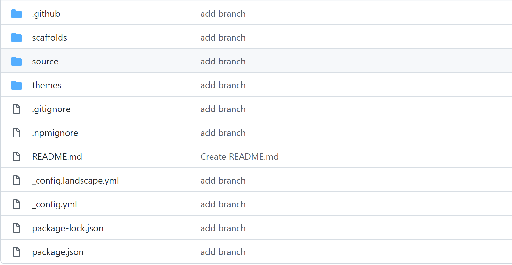
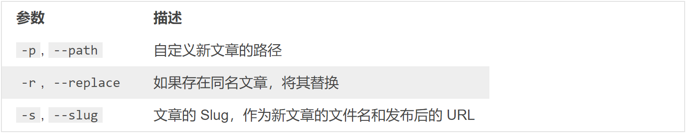

个人博客是用Hexo微博框架+Next主题搭建的，然后把搭建的博客放在Github Pages上。现在把搭建的过程，遇到的问题，简单操作记录下来。

# 环境准备

1. Node.js
2. Git

Hexo博客框架基于Node.js，下载[Node.js](http://nodejs.cn/download/), 更改安装目录，一路next至安装成功。

Git用于部署代码到github上，下载[Git](https://gitforwindows.org/)

# 安装Hexo

> 说明：在git bash中操作命令行。

1. 本地创建blog文件夹，打开git bash，进入该文件夹。
2. 安装命令

```
npm install -g hexo-cli

```

3. 创建hexo文件夹, 并初始化

```python
cd hexo
hexo init
```

4. 基本配置。修改hexo/_config.yml中网站参数。


5. 启动命令,登录localhost:4000，就可以看到生成的博客了。
```
hexo g  && hexo s
```



# hexo部署到Github

这一步，我们就可以将hexo和GitHub关联起来，也就是将hexo生成的文章部署到GitHub上，打开站点配置文件 _config.yml，翻到最后，修改为
YourgithubName就是你的GitHub账户：

```
deploy:
  type: git
  repo: https://github.com/YourgithubName/YourgithubName.github.io.git
  branch: master
```

这个时候需要先安装deploy-git ，也就是部署的命令,这样你才能用命令部署到GitHub。

```
npm install hexo-deployer-git --save
```

部署：
```
hexo clean
hexo generate
hexo deploy
```

- hexo clean清除了你之前生成的东西，也可以不加。
- hexo generate 顾名思义，生成静态文章，可以用 hexo g缩写
- hexo deploy 部署文章，可以用hexo d缩写



部署过成功中如果是链接不到远程仓库，可能是因为没有SSH，生成SSH：

```
git config --global user.name "yourname"
git config --global user.email "youremail"
git config user.name
git config user.email
ssh-keygen -t rsa -C "youremail"   #一路回车
```

把id_rsa.pub里面的信息复制到github中去。
 


# 安装Next主题

1. [Next下载](https://github.com/theme-next/hexo-theme-next), 用git clone命令，或者直接下载压缩包，并解压到themes/next文件夹。

2. 测试主题,并登录http://localhost:4000查看。

```
$ hexo clean && hexo g && hexo s
```

3. 配置Next主题

1. 网站图标设置
	
```
favicon:
small: /images/favicon-16x16-next.png  # 即为网站图标
medium: /images/favicon-32x32-next.png
apple_touch_icon: /images/apple-touch-icon-next.png
safari_pinned_tab: /images/logo.svg
#android_manifest: /images/manifest.json
#ms_browserconfig: /images/browserconfig.xml	
 ```
	
2. 网站页脚小心心定义

```
footer:
# Specify the date when the site was setup.
# If not defined, current year will be used.
#since: 2015

# Icon between year and copyright info.
icon:
# Icon name in fontawesome, see: https://fontawesome.com/v4.7.0/icons
# `heart` is recommended with animation in red (#ff0000).
name: heart
# If you want to animate the icon, set it to true.
animated: true
# Change the color of icon, using Hex Code.
color: "#ff0000"
```

3. 关闭底部由hexo强力驱动

```
  powered:
    # Hexo link (Powered by Hexo).
    enable: false
    # Version info of Hexo after Hexo link (vX.X.X).
    version: false

  theme:
    # Theme & scheme info link (Theme - NexT.scheme).
    enable: false
    # Version info of NexT after scheme info (vX.X.X).
    version: false
```

4. 菜单栏设置

```
menu:
  home: / || home
  about: /about/ || user
  tags: /tags/ || tags
  categories: /categories/ || th
  archives: /archives/ || archive
  #schedule: /schedule/ || calendar
  #sitemap: /sitemap.xml || sitemap
  #commonweal: /404/ || heartbeat

# Enable/Disable menu icons.
menu_icons:
  enable: true  #表示是否显示菜单图标icons
  badges: false  # 显示每个菜单下面有多少个内容
```

about、tags、categories取消注释，创建者三个菜单页面.

- 新建：

```
hexo new page categories
cd source/categories/index.md
```

- 编辑保存md文件：

```
---
title: 文章分类
date: 2017-05-27 13:47:40
type: "categories"
---
```

- 部署(看不到标签、分类时就是因为没有部署或者md文件的type不对)：

```
hexo clean && hexo g -d
```

about和tags同理。

5. Next主题四种风格设置 （[四种布局](https://blog.csdn.net/qq_42185634/article/details/102992499)）

```
# Schemes
#scheme: Muse
#scheme: Mist
scheme: Pisces
#scheme: Gemini
```

6. 社交链接设置

```
#social:
  #GitHub: https://github.com/yourname || github
  #E-Mail: mailto:yourname@gmail.com || envelope
  #Google: https://plus.google.com/yourname || google
  #Twitter: https://twitter.com/yourname || twitter
  #FB Page: https://www.facebook.com/yourname || facebook
  #VK Group: https://vk.com/yourname || vk
  #StackOverflow: https://stackoverflow.com/yourname || stack-overflow
  #YouTube: https://youtube.com/yourname || youtube
  #Instagram: https://instagram.com/yourname || instagram
  #Skype: skype:yourname?call|chat || skype
```

7. 友情链接设置

```
# Blog rolls
links_icon: link
links_title: Links
links_layout: block
#links_layout: inline
#links:
  #Title: http://example.com/
```

8. 侧边栏设置

```
sidebar:
  # Sidebar Position, available value: left | right (only for Pisces | Gemini).
  # 此处设置只适用于Pisces或者Gemini风格
  position: left
  #position: right

  # 侧边栏如何展示
  display: post    # 侧边栏在打开文章的时候显示
  #display: always  # 侧边栏不管在哪都显示
  #display: hide    # 隐藏侧边栏
  #display: remove  # 移除侧边栏

  # Sidebar offset from top menubar in pixels (only for Pisces | Gemini).
  offset: 12

  # 设置返回页面顶部设置，只适用于Pisces或者Gemini风格，建议开启
  b2t: true

  # 显示浏览百分比，建议开启
  scrollpercent: true

  # Enable sidebar on narrow view (only for Muse | Mist).
  onmobile: false
```

9. 文章元数据设置

```
post_meta:
  item_text: true
  created_at: true  # 创建于
  updated_at:
    enabled: false
    # If true, show updated date label only if `updated date` different from 'created date' (post edited in another day than was created).
    # And if post will edited in same day as created, edited time will show in popup title under created time label.
    # If false show anyway, but if post edited in same day, show only edited time.
    another_day: true
  categories: true  #分类
```

10. 文章字数统计设置

```
# Post wordcount display settings
# Dependencies: https://github.com/theme-next/hexo-symbols-count-time
symbols_count_time:
  separated_meta: true
  item_text_post: true
  item_text_total: false
  awl: 4
  wpm: 275
```

11. 侧边栏头像设置

```
# Sidebar Avatar
avatar:
  # in theme directory(source/images): /images/avatar.gif
  # in site  directory(source/uploads): /uploads/avatar.gif
  # You can also use other linking images.
  url:  # 此处是头像的地址
  # If true, the avatar would be dispalyed in circle. 
  rounded: true   # 设置头像是否为圆形
  # The value of opacity should be choose from 0 to 1 to set the opacity of the avatar.
  opacity: 1    # 设置不透明度，1为完全不透明，0为完全透明
  # If true, the avatar would be rotated with the cursor.
  rotated: true   # 设置鼠标放到头像上是否旋转
```

12. 代码块设置

```
codeblock:
  # Manual define the border radius in codeblock
  # Leave it empty for the default 1
  border_radius: 8   # 按钮圆滑度
  # Add copy button on codeblock
  copy_button:  # 设置是否开启代码块复制按钮
    enable: true
    # Show text copy result
    show_result: true  # 是否显示复制成功信息
```

13. 代码块风格设置

```
# Code Highlight theme
# Available values: normal | night | night eighties | night blue | night bright
# https://github.com/chriskempson/tomorrow-theme
highlight_theme: night eighties
```

14. 开启本地博客搜索功能

```
# Local search
# Dependencies: https://github.com/theme-next/hexo-generator-searchdb
local_search:
  enable: true
  # if auto, trigger search by changing input
  # if manual, trigger search by pressing enter key or search button
  trigger: auto
  # show top n results per article, show all results by setting to -1
  top_n_per_article: 1
  # unescape html strings to the readable one
  unescape: false
```

注意该搜索功能需要依赖hexo-generator-searchdb插件，依然还是使用命令npm install hexo-generator-searchdb --save来进行安装。然后 在hexo站点根目录的末尾，加入以下代码即可。

```
search:
  path: search.xml
  field: post
  format: html
  limit: 10000
```

# git分支进行多终端工作

适用于更换电脑更新博客时使用，自己也最好一直维护好线上的源代码。

### 机制

由于hexo d上传部署到github的其实是hexo编译后的文件，是用来生成网页的，不包含源文件。也就是上传的是在本地目录里自动生成的.deploy_git里面。其他文件 ，包括我们写在source 里面的，和配置文件，主题文件，都没有上传到github



### 上传分支

在github上新建hexo分支，将这个分支设为默认分支，git clone到本地。

```
git clone git@github.com:xqrshine/xqrshine.github.io.git
```

然后删除.git以外的所有文件。把之前我们写的博客源文件全部复制过来，除了.deploy_git。这里应该说一句，复制过来的源文件应该有一个.gitignore，用来忽略一些不需要的文件，如果没有的话，自己新建一个，在里面写上如下，表示这些类型文件不需要git：

```
.DS_Store
Thumbs.db
db.json
*.log
node_modules/
public/
.deploy*/
```

注意，如果你之前克隆过theme中的主题文件，那么应该把主题文件中的.git文件夹删掉，因为git不能嵌套上传，最好是显示隐藏文件，检查一下有没有，否则上传的时候会出错，导致你的主题文件无法上传，这样你的配置在别的电脑上就用不了。

然后：

```
git add .
git commit –m "add branch"
git push 
```

这样就上传完了，可以去你的github上看一看hexo分支有没有上传上去，其中node_modules、public、db.json已经被忽略掉了，没有关系，不需要上传的，因为在别的电脑上需要重新输入命令安装 。



### 更换电脑操作

安装git，Nodejs，hexo, 从分支git clone源代码到本地。然后：

```
cd xxx.github.io
# hexo init  # 此时不用初始化，因为源代码已经初始化了
npm install
npm install hexo-deployer-git --save
hexo g
hexo d
```

接下来就可以写文章了。

# 操作

### new

`hexo new [layout] <title>` 新建文章, 生成md文件，标题含空格时用引号括起来

layou布局，是指文件的不同保存路径:
- post：source/_posts/
- page: source
- draft: source/_drafts



```
hexo new "title 1"  # 生成source/_posts/title-1.md 文件, 文件名和标题同名。
hexo new page --path about/me "About me"  # 指定路径，生成source/about/me.md文件，文章的标题为“About me ”。
hexo new page --path about/me  # 指定路径 不指定title， 生成source/about/me.md文件，文章的标题为"page". 这个命令不可取
```

### generate

`hexo generate`, `hexo g` 生成静态文件。

`hexo g -d` 文件生成后立即部署网站。

### publish

`hexo publish [layout] <filename>` 发表草稿

### deploy

`hexo deploy`, `hexo d` 部署。只要做出修改，就必须生成-部署。

### clean

`hexo clean` 清除缓存文件（db.json）和已经生成的静态文件（publish），在某些情况（尤其是更换主题后），如果发现您对站点的更改无论如何也不生效，您可能需要运行该命令。

### 插入图片

 [npm i hexo-easy-images -s](https://github.com/boboidream/hexo-easy-images)：
 
 
